<p align="center">
  <a>
    
  </a>
</p>
<h2 align="center">Getting Started With Git and Github</h2>
<h4 align="center">This project will demonstrate the working flow of Git and Github</h4>

### Table of contents

- [Setting up Github Account](#setting-up-github-acccount)
- [Setting up Git on your Local machine](#setting-up-git-on-your-local-machine)
- [Setting up SSH keys for your git and github account](#setting-up-ssh-keys-for-your-git-github-acccount)
- [Git WorkFlow](#git-workflow)
- [Working with Local Repository](#working-with-local-repository)
- [Viewing Your Staged and Unstaged Change](#viewing-your-staged-and-unstaged-change)
- [Viewing the Commit History](#viewing-the-commit-history)
- [Ignoring Files](#ignoring-files)
- [Deleting Files](#deleting-files)
- [Renaming and Moving Files](#renaming-and-moving-files)

## Setting up Github Account

1. Go to [GitHub](github.com)
2. Signup using a valid gamail account and setup password
3. Explore the options for further setting of your profile

## Setting up Git on your Local machine

**Note:** I personally recommend that you should have VS Code installed in your machine as this will very handy to work with any type of project
as well as can be used as the base text editor. You can Download it from [Here>>](https://code.visualstudio.com/download)

1. Download git from [Here>>](https://www.atlassian.com/git/tutorials/install-git) (according to your operating system + follow the instruction at the site)
2. For windows select both git bash and command prompt option during the installation process and for other options keep the default
3. Open git bash
4. Run the following command:

```bash
$ git config --global user.name "Your name(may the github user name)"
$ git config --global user.email "your email(may the email used to signup github)"
$ git config --global core.editor "code --wait"
```

If you are using Notepad++ as your text editor, then you have to run the following command inplace
of **git config --global core.editor "code --wait"**:

For Notepad++ (Windows 64-bit)

```bash
$ git config --global core.editor "'C:\Program Files\Notepad++\notepad++.exe' -multiInst -notabbar -nosession-noPlugin"
```

If you have a 32-bit editor on a Windows 64-bit system, run the following command instead:

```bash
$ git config --global core.editor "'C:\Program Files (x86)\Notepad++\notepad++.exe' -multiInst -notabbar -nosession-noPlugin"
```

This is the default configuraion for your git in your Local machine. You can check the settings by runnig:

```bash
$ git config --list
```

#

## Setting up SSH keys for your git and github account

You can follow the [link](https://help.github.com/en/github/authenticating-to-github/about-ssh)
or you can follow the steps bellow:

**About SSH:**

Using the SSH protocol, you can connect and authenticate to remote servers and services.
With SSH keys, you can connect to GitHub without supplying your username or password at each visit.
When you set up SSH, you'll generate an SSH key and add it to the ssh-agent and then add the key to your GitHub account.
Adding the SSH key to the ssh-agent ensures that your SSH key has an extra layer of security through the use of a passphrase.

1. Open Terminal or Git Bash.

2. Paste the text below, substituting in your GitHub email address.

```bash
$ ssh-keygen -t rsa -b 4096 -C "your_email@example.com"
```

Please replace the email with the email you configured above.
You will be prompted to enter password like bellow for your SSH key:

```bash
> Generating public/private rsa key pair.
#When you're prompted to "Enter a file in which to save the key," press Enter. This accepts the default file location.
> Enter a file in which to save the key (/home/you/.ssh/id_rsa): [Press enter]
> Enter passphrase (empty for no passphrase): [Type a passphrase]
> Enter same passphrase again: [Type passphrase again]
```

3. **Adding your SSH key to the ssh-agent:**

   a. Start the ssh-agent in the background.

       $ eval "$(ssh-agent -s)"
       > Agent pid 59566

   b. Add your SSH private key to the ssh-agent.

       $ ssh-add ~/.ssh/id_rsa

4. **Add the SSH key to your GitHub account:**

   a. Copy the SSH key to your clipboard:

        $ clip < ~/.ssh/id_rsa.pub

   This command copies the contents of the id_rsa.pub file to your clipboard
   which you can paste to your GitHub acccount.

   b. Go to your github account

   c. In the upper-right corner of any page, click your profile photo, then click Settings.

<p align="center">
  <a>
    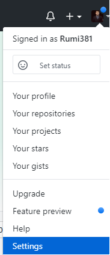
  </a>
</p>

d. In the user settings sidebar, click SSH and GPG keys.

<p align="center">
  <a>
    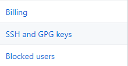
  </a>
</p>

e. Click New SSH key or Add SSH key.

<p align="center">
  <a>
    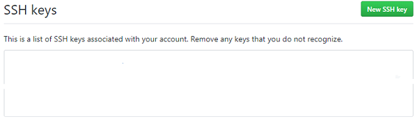
  </a>
</p>

f. In the "Title" field, add a descriptive label for the new key.
For example, if you're using a personal Mac, you might call this key "Personal MacBook Air".

g. Paste your key into the "Key" field.

<p align="center">
  <a>
    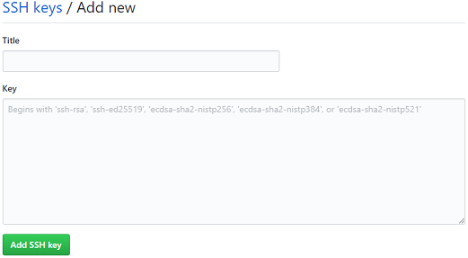
  </a>
</p>
    h. Click Add SSH key.

<p align="center">
  <a>
    
  </a>
</p>

i. If prompted, confirm your GitHub password.

<p align="center">
  <a>
    
  </a>
</p>

### **_If you want to change the passphrase of your SSH key_**

You can change the passphrase for an existing private key without regenerating the keypair by typing the following command:

```bash
$ ssh-keygen -p
```

You will be prompted as bellow:

```bash
> Enter file in which the key is (/Users/you/.ssh/id_rsa): [Hit enter]
> Key has comment '/Users/you/.ssh/id_rsa'
> Enter new passphrase (empty for no passphrase): [Type new passphrase]
> Enter same passphrase again: [One more time for luck]
> Your identification has been saved with the new passphrase.
```

If your key already has a passphrase, you will be prompted to enter it before you can change to a new passphrase.

### **_Auto-launching ssh-agent on Git_**

Now when you wil interect your github account (e.x. clone, fetch, pull, push) you have enter the passphrase of your ssh key everytime. If you don't want enter it every time, paste the following scripts into your ~/.profile or ~/.bashrc file.

```bash
env=~/.ssh/agent.env

agent_load_env () { test -f "$env" && . "$env" >| /dev/null ; }

agent_start () {
    (umask 077; ssh-agent >| "$env")
    . "$env" >| /dev/null ; }

agent_load_env

# agent_run_state: 0=agent running w/ key; 1=agent w/o key; 2= agent not running
agent_run_state=$(ssh-add -l >| /dev/null 2>&1; echo $?)

if [ ! "$SSH_AUTH_SOCK" ] || [ $agent_run_state = 2 ]; then
    agent_start
    ssh-add
elif [ "$SSH_AUTH_SOCK" ] && [ $agent_run_state = 1 ]; then
    ssh-add
fi

unset env
```

Now enter the following command:

```bash
$ source ~/.profile
# of if you pasted in .bashrc file
$ source ~/.bashrc
```

Now you will be promted to enter the ssh key passphrase, enter it and thats it. Now will never have to enter the passphrase again when you interct your remote repository next time.

#

#

<p align="center">
  <a>
    
  </a>
</p>
<h2 align="center">Git WorkFlow</h2>

## Git WorkFlow

This section will demonstrste the most common workflow of git to start a git repository.

<div class='embed-responsive embed-responsive-16by9>

<iframe width="560" height="315" src="https://www.youtube.com/embed/videoseries?list=PL7laMxkUL_O4J2CMNmQxpgSo7L1sHNgYu" frameborder="0" allow="accelerometer; autoplay; clipboard-write; encrypted-media; gyroscope; picture-in-picture" allowfullscreen></iframe>

</div>

## Working with Local Repository

1. Select a folder/directory on your computer

1. Right Click on the folder and select open Git Bash here

<p align="center">
  <a>
    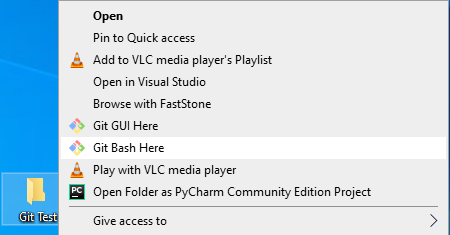
  </a>
</p>

3. To make this folder a Git repository, type the following command:

```bash
$ git init
```

<p align="center">
  <a>
    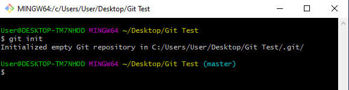
  </a>
</p>

This will initialize the folder as a Git repository with a hidden folder named **.git**. Notice changed prompt (master) as the pricipal branch of your repository.

You can still check the folder by the following command:

```bash
$ ls -la
```

<p align="center">
  <a>
    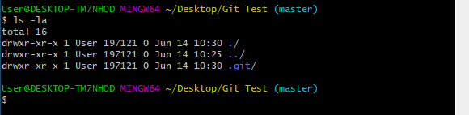
  </a>
</p>

4. Now you can start your project by adding any number of file of any kind in the folder.
   For example if we add a text.txt file in the folder and then run the following command:

```bash
$ git status
```

<p align="center">
  <a>
    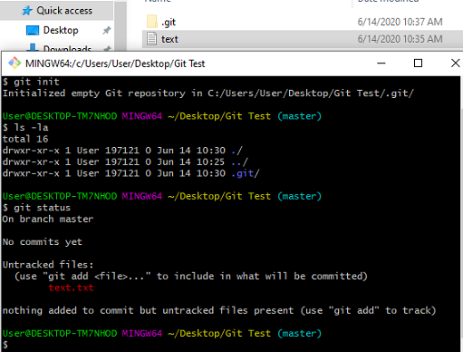
  </a>
</p>

You can see an untraced file named text.txt as this file is now in our workspace.
Will call this as our working copy.

5. To stage this file for git repository run the following command:

```bash
$ git add .
```

**Note:** Here a period(**.**) is used to add all file to staging area from the current working folder. If want to add all the files from workspace containing all other directories and subdirectories, you should enter the following:

```bash
$ git add -A
```

You can add specific file by replacing the period or the -A tag with file name.

<p align="center">
  <a>
    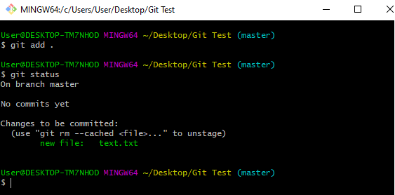
  </a>
</p>

You can see the difference by running **git status** again.

Now if you want to unstage the file due any reason, run the following command:

```bash
$ git rm --cached filename
```

6. This the most important step. Now if you are satisfied with your work and ready
   to commit your work to the git repository, run the following command:

```bash
$ git commit -m "Descriptive messages"
```

Within double qoute (""), please enter a total Descriptive message of your status of the commit
as you will see this message next time you want to check the commit history. A proper
message will help you to understand the commit history better.

<p align="center">
  <a>
    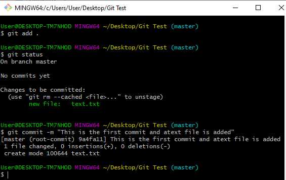
  </a>
</p>

7. Now if you run the **\$git status** command again, you will see that you git repository
   is up to date and nothing to be committed.

<p align="center">
  <a>
    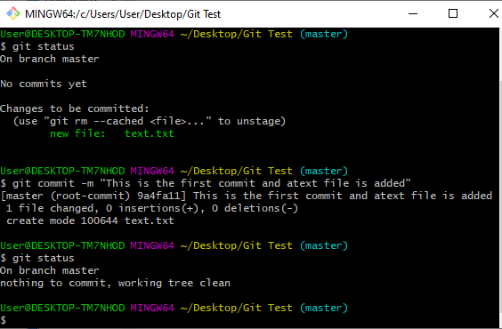
  </a>
</p>

8. Now you can see your commit history by running:

```bash
$ git log
```

This command shows you all the commit history with a unique string of charectes or known as **Hash Number** and the date and time of committing
as well as the messages you
put at the time of committing.

<p align="center">
  <a>
    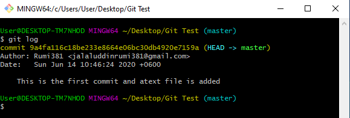
  </a>
</p>

9. Now you can continue your work with the files you have in the folder/directory you are working.
   And to update your work in the git repository please repeat the steps from step 5.

## Viewing Your Staged and Unstaged Change

Suppose you have modified some files, added or deleted some files/directory from your working copy.
Now you can see the status of your working copy before staging by running **git status**

<p align="center">
  <a>
    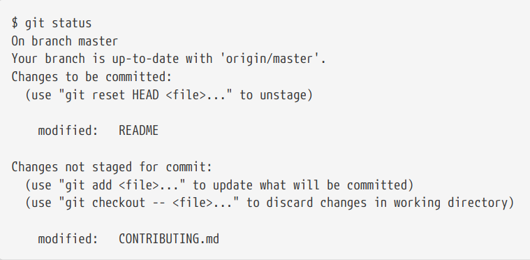
  </a>
</p>

If the **git status** command is too vague for you — you want to know exactly what you changed, not
just which files were changed — you can use the **git diff** command. You’ll probably use it most often to answer these two questions: What have you
changed but not yet staged? And what have you staged that you are about to commit? Although git
status answers those questions very generally by listing the file names, git diff shows you the
exact lines added and removed — the patch, as it were.

<p align="center">
  <a>
    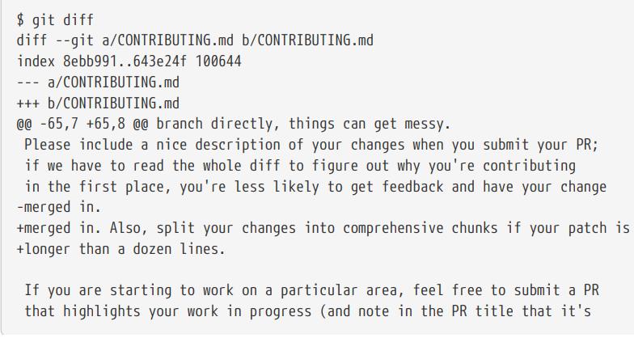
  </a>
</p>

That command compares what is in your working directory with what is in your staging area. The
result tells you the changes you’ve made that you haven’t yet staged.

If you want to see what you’ve staged that will go into your next commit, you can use git diff
--staged. This command compares your staged changes to your last commit:

<p align="center">
  <a>
    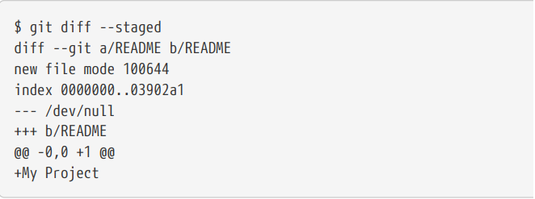
  </a>
</p>

**Note:** If the promp is lengthy, Press enter key repeatedly to proceed with the promt.
Press q to exit at any stage.

## Viewing the Commit History

After you have created several commits, or if you have cloned a repository with an existing commit
history, you’ll probably want to look back to see what has happened. The most basic and powerful
tool to do this is the **git log** command.

```bash
$ git log
```

<p align="center">
  <a>
    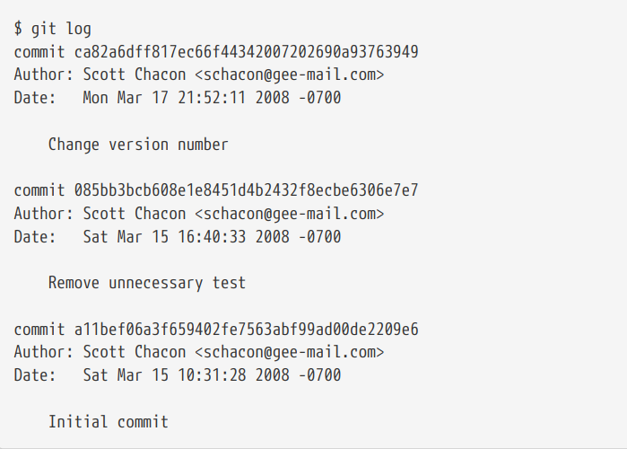
  </a>
</p>

By default, with no arguments, git log lists the commits made in that repository in reverse
chronological order; that is, the most recent commits show up first. As you can see, this command
lists each commit with its SHA-1 checksum, the author’s name and email, the date written, and the
commit message.

A huge number and variety of options to the **git log** command are available to show you exactly
what you’re looking for. Here, we’ll show you some of the most popular.

One of the more helpful options is **-p** or **--patch**, which shows the difference (the patch output)
introduced in each commit. You can also limit the number of log entries displayed, such as using -2
to show only the last two entries.

<p align="center">
  <a>
    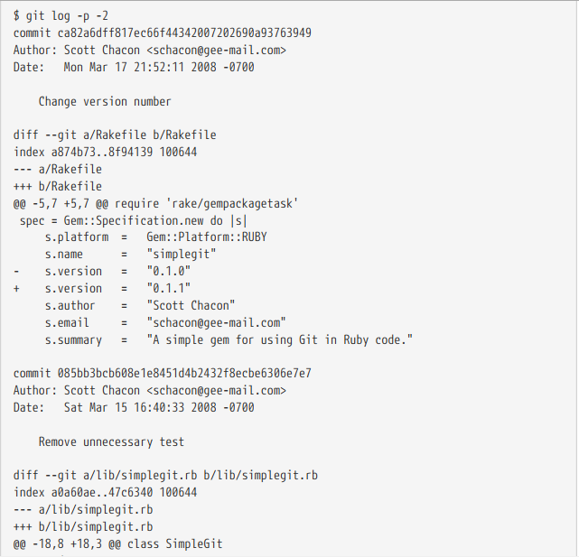
  </a>
</p>

This option displays the same information but with a diff directly following each entry. This is very
helpful for code review or to quickly browse what happened during a series of commits that a
collaborator has added. You can also use a series of summarizing options with git log. For
example, if you want to see some abbreviated stats for each commit, you can use the **--stat** option:

```bash
$ git log --stat
```

You can also use the following command for a quick overview of the commit history:

```bash
$ git log --all --decorate --oneline --graph
```

As it is a long command, you can set an alias for this:

```bash
$ alias graph='git log --all --decorate --oneline --graph'
```

## Ignoring Files

Often, you’ll have a class of files that you don’t want Git to automatically add or even show you as
being untracked. These are generally automatically generated files such as log files or files
produced by your build system. In such cases, you can create a file listing patterns to match them
named **.gitignore**.

To create a **.gitignore** file run the following command:

```bash
$ touch .gitignore
```

Now open the **.gitignore** file in the text editor and enter your required files and folder name thats need to be innored.

The rules for the patterns you can put in the .gitignore file are as follows:

- Blank lines or lines starting with # are ignored.
- Standard glob patterns work, and will be applied recursively throughout the entire working
  tree.
- You can start patterns with a forward slash (/) to avoid recursivity.
- You can end patterns with a forward slash (/) to specify a directory.
- You can negate a pattern by starting it with an exclamation point (!).

Here are some way of doing different ignoring operation:

<p align="center">
  <a>
    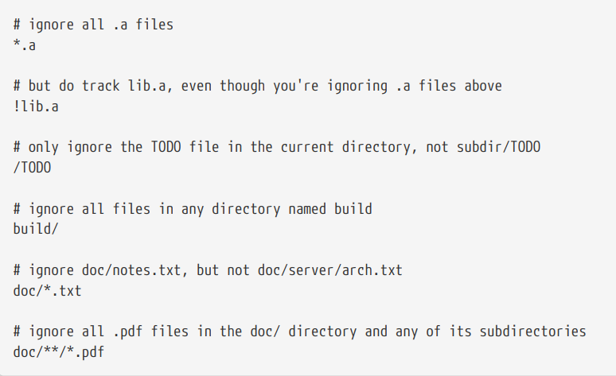
  </a>
</p>

## Deleting Files

There are many ways to remove or delete files from the repository. But I'll demonstrste the easier way to
to this operation.

Suppose you have a file name PROJECTS.md in your your repository, but you want to delete this file. Just run:

```bash
$ git rm PROJECTS.md
```

You’ll be prompted like the following:

<p align="center">
  <a>
    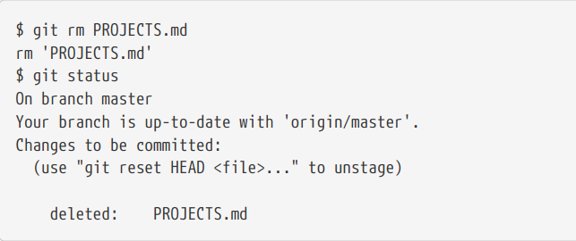
  </a>
</p>

The next time you commit, the file will be gone and no longer tracked. If you modified the file or
had already added it to the staging area, you must force the removal with the -f option. This is a
safety feature to prevent accidental removal of data that hasn’t yet been recorded in a snapshot and
that can’t be recovered from Git.

**Note:** You can delete any file or even an entire directory with this command. Just replace the name after the space following **rm**.

Another useful thing you may want to do is to keep the file in your working tree but remove it from
your staging area. In other words, you may want to keep the file on your hard drive but not have
Git track it anymore. This is particularly useful if you forgot to add something to your .gitignore
file and accidentally staged it, like a large log file or a bunch of .a compiled files. To do this, use the
--cached option:

```bash
$ git rm --cached filename
```

You can pass files, directories, and file-glob patterns to the git rm command. That means you can do
things such as:

```bash
$ git rm log/\*.log
```

Note the backslash (\) in front of the \*. This is necessary because Git does its own filename
expansion in addition to your shell’s filename expansion. This command removes all files that have
the .log extension in the log/ directory. Or, you can do something like this:

```bash
$ git rm \*~
```

This command removes all files whose names end with a ~.

## Renaming and Moving Files

There are different ways to do this operation. The easy way is to use **git mv** command.

1. If you want to rename a file, just run:

```bash
$ git mv file_from file_to
```

<p align="center">
  <a>
    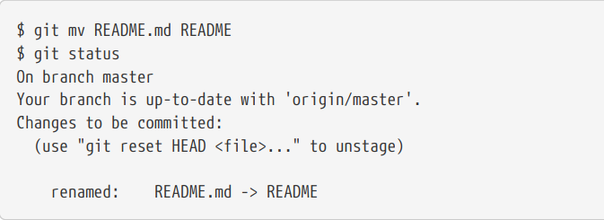
  </a>
</p>

2. If you want to move a file to a specific directory, just run:

```bash
$ git mv file_from folder_to
```

3. Even if you want to move a file to a specific folder and renaming it at the same time, you can do this by runnig:

```bash
$ git mv file_from folder_to/file_to
```
